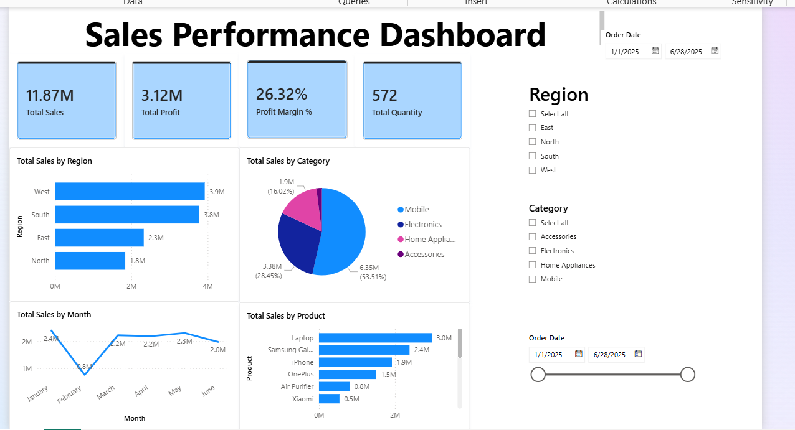

# Sales Dashboard - Power BI Project

## Project Overview
This project is an interactive sales dashboard created using Power BI.

The dashboard helps analyze:
- Sales performance
- Revenue trends
- Product-wise sales
- Category analysis

---

## Features
- KPI Cards
- Bar Charts
- Pie Charts
- Slicers and Filters
- Interactive Dashboard

---

## Tools Used
- Power BI
- Power Query
- Data Visualization

---

## Dashboard Preview

---

## Project File
The `.pbix` file is included in this repository.
